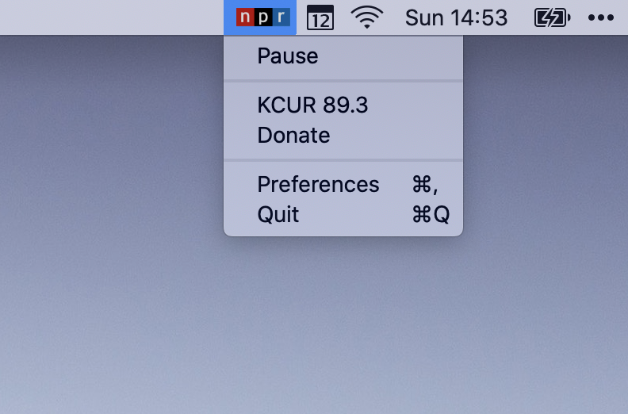

# npr

This is an [NPR](https://npr.org) Mac app that sits in your menu bar.

## screenshots

##### playing

##### paused

## features

This app allows you to:

* Stream an NPR audio stream.
* Toggle play/pause using the macOS play/pause media keys.
* Change the NPR station you want to listen to in the Preferences window (it is saved for subsequent runs)
* ... that's it!

## feedback

If you have feedback, please open an issue.

## about

Proudly made in Kansas City by [@connor](https://twitter.com/connor).

## download

You can download a copy of the app [here](https://github.com/connor/npr/releases/).
